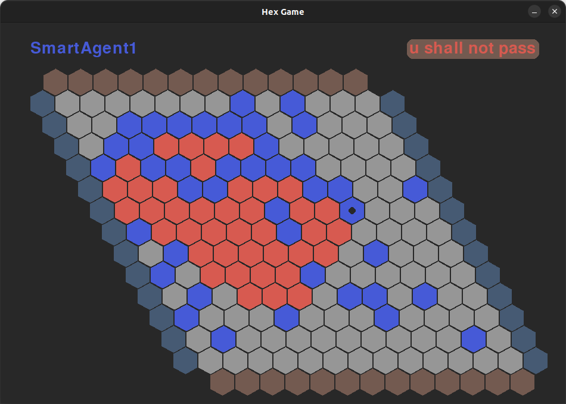

# MCTS Hex Agent - Universidad de San Andrés

## Overview

This project is part of the **Fundamentals of Artificial Intelligence (FIA)** course at Universidad de San Andrés (UDESA), 2025 First Quarter. It implements an intelligent agent for playing the game of Hex using Monte Carlo Tree Search (MCTS) algorithms.

## The Game of Hex

Hex is a two-player connection game played on a hexagonal grid. The objective is simple but strategically complex:
- **Player 1** (horizontal player) must connect the left and right sides of the board
- **Player 2** (vertical player) must connect the top and bottom sides of the board
- Players alternate turns placing stones on empty hexagonal cells
- The first player to create a continuous path between their target sides wins



## Project Structure

The project is organized into several key components:

- **`hex_udesa/`**: Core game engine and environment
- **`scripts/agents/`**: Agent implementations
- **`scripts/agents/GÖTZ/wannabeMohex.py`**: The main (my) MCTS agent (detailed below)
- **`scripts/1v1.py`**: Script for running 1v1 matches
- **`scripts/checkpoint0.py`**: Agent testing script for checkpoint evaluations
- **`scripts/swiss_tournament.py`**: Tournament system for final performance evaluation

## Installation

```bash
# 1. Fork the repository into your account
# 2. Clone the repository
git clone https://github.com/YOUR_ACCOUNT/MCTS_hexAgent.git

# 3. Navigate to the hex_udesa directory
cd MCTS_hexAgent/hex_udesa

# 4. Install the package
pip install -e .
```

## Usage

### Running Games

Put your agents inside the `scripts/agents/SURNAME` folder, then import them in one of the following scripts:

- **`1v1.py`**: Simple 1v1 game (you can play against yourself using `HumanAgent`)
- **`checkpoint0.py`**: Used to test your agent at checkpoint 0
- **`swiss_tournament.py`**: Used to test your agent's final performance

The agent imports are automatic - no need to modify the testing scripts.

## The wannabeMohex Agent

The **wannabeMohex** agent is a sophisticated MCTS implementation that incorporates several advanced techniques:

### Core Features

1. **Monte Carlo Tree Search (MCTS)**
   - Time-limited search with 30-second thinking time
   - Random exploration strategy to avoid bias
   - Statistical evaluation of move quality

2. **AMAF Heuristic (All Moves As First)**
   - Combines traditional MCTS statistics with AMAF statistics
   - Uses adaptive weighting parameter β = √(k/(3×plays + k)) where k=10,000
   - Improves move evaluation by considering moves played later in simulations

3. **Union-Find Data Structure**
   - Efficient connectivity detection for win condition evaluation
   - Optimized with path halving and union by rank
   - Enables fast determination of connected paths

4. **Virtual Bridges Recognition**
   - Automatically detects and connects "virtual bridges" (guaranteed connections)
   - Understands advanced Hex connection patterns
   - Improves position evaluation accuracy

### Algorithm Details

```python
def mcts(self, board):
    # Initialize statistics for all legal moves
    wins, plays = {}, {}
    amaf_wins, amaf_plays = {}, {}
    
    # Time-limited search
    while time_remaining:
        # 1. SELECTION: Random exploration
        move = random.choice(legal_moves)
        
        # 2. SIMULATION: Random rollout to game end
        result, played_moves = self.simulate(board, move)
        
        # 3. BACKPROPAGATION: Update statistics
        # - Traditional MCTS stats
        # - AMAF stats for all moves in simulation
        
    # 4. SELECTION: Best move using combined statistics
    return best_move_by_combined_winrate()
```

### Strategic Approach

1. **Opening**: Random legal move to avoid predictable patterns
2. **Mid-game**: MCTS with AMAF for balanced exploration/exploitation
3. **Evaluation**: Union-Find with virtual bridges for accurate position assessment

### Technical Implementation

The agent uses several optimizations:
- **Path Halving**: Optimizes Union-Find find operations
- **Union by Rank**: Ensures balanced tree structures
- **Virtual Bridge Detection**: Recognizes patterns like:
  - Direct bridges (distance-2 connections with empty intermediates)
  - Complex bridge formations

## Performance

The wannabeMohex agent demonstrates strong performance through:
- Sophisticated position evaluation
- Efficient search algorithms
- Advanced Hex-specific heuristics
- Time-optimal decision making

## Development Notes

- Agent name: `wannabeMohex`
- Student: Götz
- Student ID: 35725
- Implementation language: Python with NumPy

## Bugs and Issues

Please report any bugs or issues with the engine. Pull requests to add tests or fix bugs are welcome.

---

*This project demonstrates the application of Monte Carlo Tree Search algorithms to the strategic game of Hex, showcasing advanced AI techniques in game playing.*